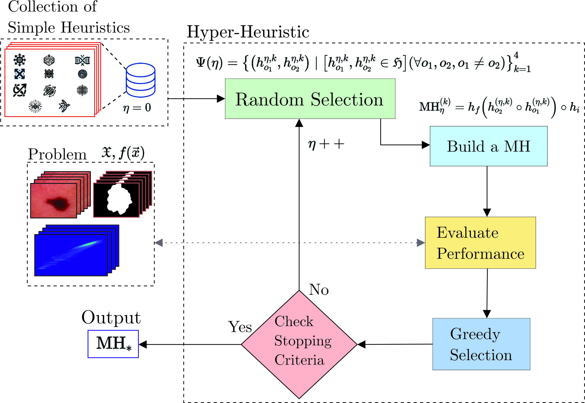
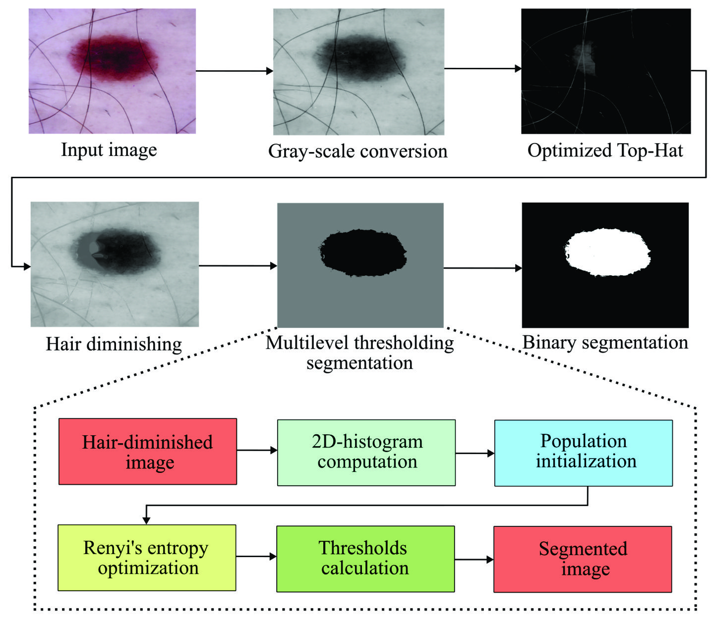

# Paper7_IEEE_SSCI_2025

Welcome to the Manuscript 7: Result Simulation IEEE SSCI 2025  
Data and code from the article entitled: **"Automated Tailoring of Heuristic-Based Renyi’s Entropy Maximizers for Efficient Melanoma Segmentation"**.  

**Authors:**  
- Daniel F. Zambrano-Gutierrez  
- Jorge Ramos-Frutos  
- Oscar Ramos-Soto  
- Juan Gabriel Avina-Cervantes  
- Diego Oliva  
- Jorge M. Cruz-Duarte  

---

## Abstract  
This repository contains the data and code used in the experiments described in the article. The work proposes a novel automated methodology using hyper-heuristics to tailor metaheuristics for melanoma segmentation, with Renyi’s entropy as the objective function. Experimental results demonstrate that the tailored metaheuristics achieve efficient segmentation with minimal computational cost.

---
## Methodology  

### Hyper-Heuristic Process  

Below is an overview of the hyper-heuristic methodology used to obtained tailored metaheuristics:  

  

### Segmentation Methodology  

The figure below illustrates the segmentation pipeline employed for melanoma detection:  

.  

---

## Requirements  

- **Python**: v3.7+  
- **Matlab**: R2024a  
- **Frameworks:**  
  - [CUSTOMHyS Framework](https://github.com/jcrvz/customhys.git)  
  - [MathWorks Engine API for Python](https://www.mathworks.com/help/matlab/matlab_external/install-the-matlab-engine-for-python.html)  
- **Python Libraries:**  
  - os  
  - matplotlib  
  - seaborn  
  - numpy  
  - pandas  
  - scipy.stats  

---

## Files
* [Hyper-heuristic process](https://github.com/Danielfz14/Paper7_IEEE_SSCI_2025/blob/main/Random2.py)
* [HH process Data](https://github.com/Danielfz14/Paper7_IEEE_SSCI_2025/blob/main/DataHH.txt)
* [Main code for segmentation](https://github.com/Danielfz14/Paper7_IEEE_SSCI_2025/blob/main/datacole.m)

### 1. Clone the Repository  
```bash
git clone https://github.com/Danielfz14/Paper7_IEEE_SSCI_2025.git
cd Paper7_IEEE_SSCI_2025
